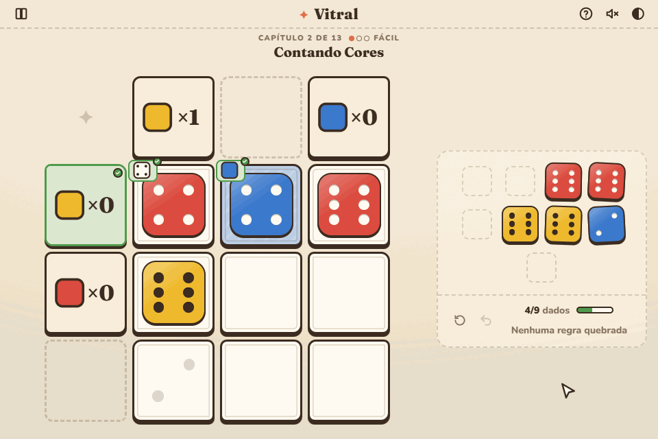
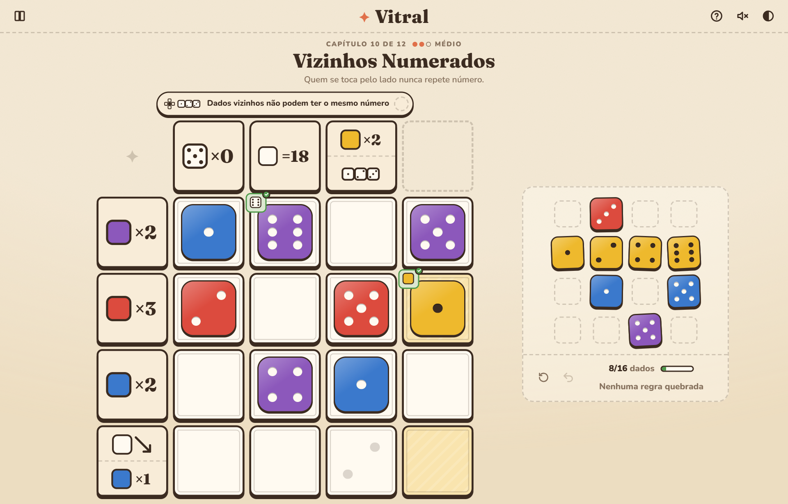
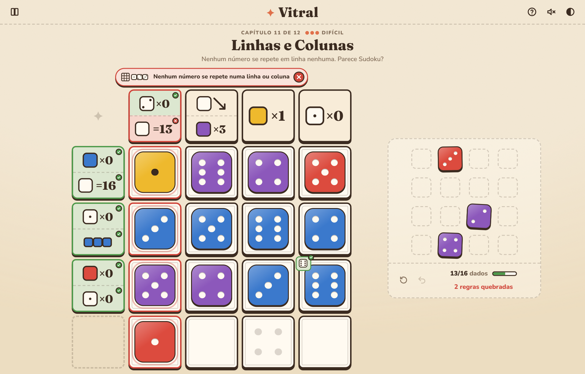
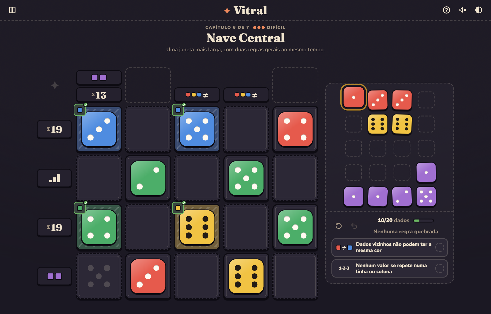
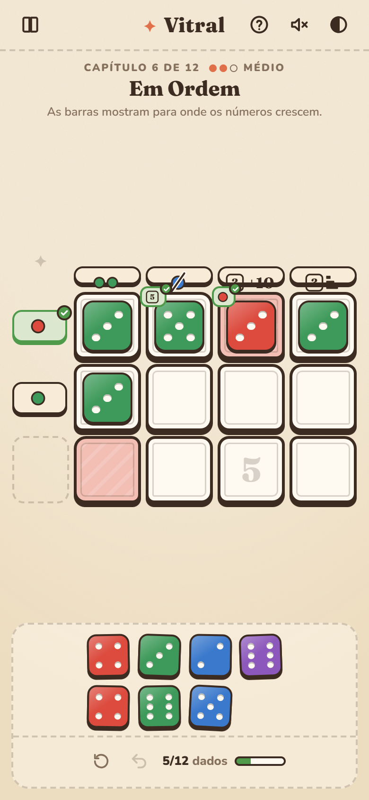

<div align="center">

# ✦ Vitral

**A cozy stained-glass dice logic puzzle.**<br>
Place every die in the window without breaking a single rule.




</div>

---

## The idea

Vitral started as a fork of [Inklink](https://github.com/Kyando/inklink), a word-association puzzle inspired by *Entre-linhas*, *Sudoku*, *Termo* and the *Einstein riddle*. Words are subjective; **dice are not**. So the board keeps the same shape (rules on rows and columns, one piece per cell, a full board), but the pieces become coloured dice, borrowing the window-building of the board game *Sagrada*.

Every level gives you exactly one die per cell, and rules written as **symbols**.

## A symbol language

Everything is a die, as in *Sagrada*: the **fill** is the color (transparent = any color) and the **pips** are the number (no pips = any number). Each rule is one composed glyph, read left to right:

| Part | Meaning |
|---|---|
| **Subject** | a red tile = red · a die with 5 pips = five · an empty die = any die |
| **Operator** | ×2 exactly 2 (×0 none) · =12 adds up to 12 · <4 all below 4 · >3 all above 3 · ↗ numbers only go up (↘ down) |
| **Unique / identical** | three small dice that differ (or match) in color or in number: they carry the attribute themselves |
| **Scope** (modifiers only) | a cross of cells = neighbours · a grid = every row and column |

Where a glyph sits says where it applies: row rules on the left, column rules on top, **modifiers** above the window (they apply to all of it). Cells use the same language as the board of *Sagrada*: tinted glass asks for a color, shaded pips ask for a number.

Tap any glyph to read it; the help screen has the full glossary.

## Learning one mechanic at a time

Thirteen chapters introduce the language one piece at a time, each with a "new symbol" card the first time it appears: colored and carved cells → counting colors → different colors → sums → different numbers → order → same color → forbidden number → less and greater than → neighbours (first modifier) → neighbours with numbers → every row and column → a final mixed window. A chapter only uses what has already been taught.

## Live validation

There is no *Check* button: the board is validated on every move, and each rule shows its own state.

- **open**: nothing wrong yet;
- ✅ **satisfied**: its row/column/cell (or the whole board) is complete and correct;
- ❌ **broken**: the dice already placed make it impossible, whatever goes in the empty cells (a row that already went past its sum, two red neighbours, two dice out of order in an increasing row). Sums and order only break on what you can see: a single die never breaks them. The dice at fault are outlined in red.

Feedback never peeks at the intended solution or at the dice still in the tray, so it only tells you what you could have worked out yourself. The window is complete when the board is full and every rule is satisfied: *any* arrangement that satisfies the rules wins.

## Screenshots

<table>
  <tr>
    <td colspan="2"></td>
  </tr>
  <tr>
    <td width="50%"></td>
    <td width="50%"></td>
  </tr>
</table>

<p align="center">
  
</p>

## Fair puzzles

Every level is **generated and machine-verified**:

1. A random full board is drawn that respects the chosen board rules.
2. Every row/column rule that is true for it becomes a candidate (plus cell restrictions).
3. Rules are added until a **human-style solver** can finish the board, then every rule the solver doesn't need is removed (a few can be kept back to make early chapters gentler).

The human-style solver only makes sound eliminations: a die can't go where it already breaks a rule, a cell with one possible die is filled, and a rule's bounds are checked against what the other cells could still receive ("this row needs 15 from two dice, so neither can be below 3"). If it fills the board, the solution is unique **and** reachable by reasoning alone, with no trial and error. Tests also confirm uniqueness with an exhaustive search.

Difficulty comes from board size and how often that deeper "reach" reasoning is needed.

## Development

```bash
npm install
npm run dev                          # play locally
npm test                             # rules, solver agreement, generator and every shipped level
npm run levels                       # validate levels and print their difficulty (-- --rules to list them)
npm run levels:generate              # regenerate the chapters (teaching plan in scripts/generate-levels.ts)
npm run levels:generate -- 3 --dry   # preview one chapter without writing it
npm run media                        # regenerate README screenshots & GIF (uses local Edge)
npm run deploy                       # build and publish to GitHub Pages
```

```
src/
  core/      pure TypeScript, no DOM
    types.ts     level format, dice and rules
    rules.ts     rule evaluation on partial boards (UI) + compiled incremental checks (solver)
    solver.ts    exhaustive search (solution counting)
    deduce.ts    human-style solver → uniqueness proof and difficulty
    generate.ts  seeded level generator
    describe.ts  player-facing rule text (pt-BR)
  ui/dice.ts    dice and the rule glyph renderer
  ui/lessons.ts "new symbol" cards and the glossary
  game/      session state, undo, persistence
  levels/    *.json levels (ordered by file name)
  ui/        vanilla DOM + CSS (FLIP animations, pointer drag, synth SFX)
scripts/     level generation, reports, media capture, deploy
tests/       Vitest suite
```

### Level format

```jsonc
{
  "id": "capela",
  "title": "Capela",
  "rows": 4,
  "cols": 4,
  // one die per cell: colour letter (R, Y, G, B, P) + value
  "dice": ["R2", "R5", "Y1", "B6"],
  "rules": [
    { "type": "adjacent-colors-differ" },
    { "type": "sum", "line": "row", "index": 0, "value": 14 },
    { "type": "color-count", "line": "col", "index": 2, "color": "red", "count": 0 },
    { "type": "cell-color", "row": 1, "col": 3, "color": "blue" }
  ],
  // die codes in reading order
  "solution": ["B5", "Y5", "R2", "P2"]
}
```

## Roadmap

- [ ] More rule types (sum parity, "at least one", diagonals, min/max)
- [ ] Colour-blind mode with a symbol per colour
- [ ] A lab page to tweak the generator plan and playtest boards
- [ ] Daily puzzle with a shareable result
- [ ] Printable puzzle-book edition from the same level files

## Credits

Designed and developed by **Bruno Ribeiro**. Inspired by *Sagrada*, *Entre-linhas*, *Sudoku*, *Termo* and the Einstein riddle.
